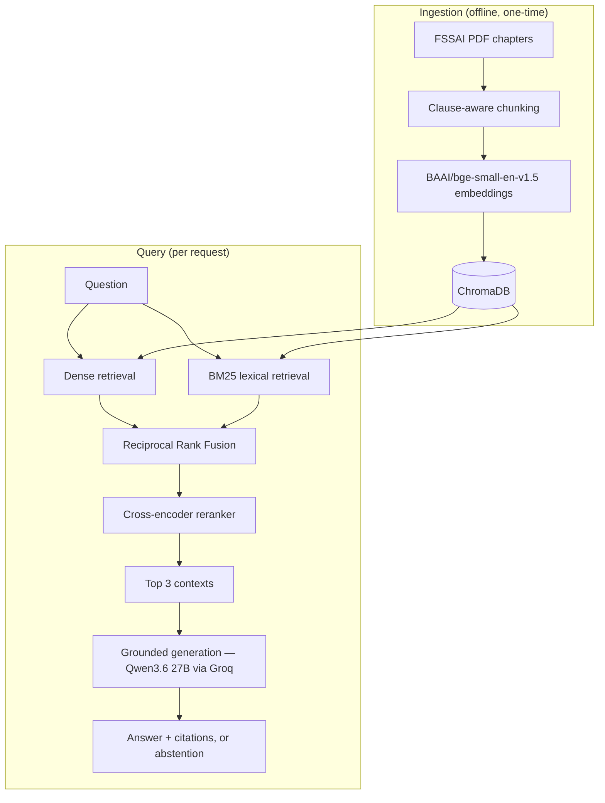

# FSSAI Food Safety RAG QA System

An end-to-end RAG QA system over FSSAI food safety regulations: clause-aware
chunking, three retrieval strategies compared systematically (dense,
hybrid, hybrid + reranking), citation-grounded generation, and a
production-shaped API layer and containerized deployment. This is a
portfolio project — logged and evaluated end to end; see
[Limitations](#limitations) for what "production-shaped" does and doesn't
claim.

## Results

### Primary experiment — frozen, pre-registered (124 chunks, 3 chapters)

15 evaluation questions with clause-level ground truth were committed to
git (`data/qa_set.json`, commit `6fd13ef`) *before* any retrieval,
reranking, generation, or scoring ran against them. This is the project's
headline, reportable result.

**Retrieval comparison (recall@k)** — fraction of the 15 questions where
the ground-truth clause appears among the top-k retrieved chunks:

| Arm | recall@1 | recall@3 | recall@5 | recall@10 | recall@20 |
|---|---|---|---|---|---|
| Dense | 0.900 | 1.000 | 1.000 | 1.000 | 1.000 |
| Hybrid (Dense + BM25 + RRF) | 0.900 | 1.000 | 1.000 | 1.000 | 1.000 |
| Hybrid + reranker | 0.767 | 1.000 | 1.000 | 1.000 | 1.000 |

**recall@3 — the system's actual operating point (`k_final=3`) — is 1.000
for all three arms, on every one of the 15 questions.** Dense retrieval
already retrieved the required clause within the top 3 for every question
in this benchmark, leaving hybrid retrieval and reranking no headroom to
improve recall on top of it.

**RAGAS evaluation** (LLM-judged, `gpt-5-mini`, 180 metric evaluations —
15 questions × 3 arms × 4 metrics):

| Arm | Faithfulness | Answer Relevancy | Context Precision | Context Recall |
|---|---|---|---|---|
| Dense | 0.978 | 0.935 | 0.811 | 1.000 |
| Hybrid | 0.933 | 0.934 | 0.822 | 1.000 |
| Hybrid + reranker | 0.911 | 0.862 | 0.767 | 0.933 |

On the `parametric_known == false` subset (12 of 15 questions — those
where the generator's un-grounded, no-context answer does *not* already
match the FSSAI figure by coincidence): Dense 0.972 / 0.942 / 0.764 / 1.000;
Hybrid 0.972 / 0.947 / 0.778 / 1.000; Hybrid+reranker 0.917 / 0.854 /
0.750 / 0.917.

Full data: `reports/ragas_summary.csv`, `reports/arm_comparison.csv`,
`reports/failure_analysis.md`.

### Secondary experiment — run afterward, to test scale-dependence (263 chunks, 9 chapters)

The primary result raises an obvious question: is recall@3 = 1.00 for
dense-only retrieval a property of dense retrieval on this domain, or an
artifact of a corpus small enough that saturation was inevitable? This
experiment re-runs the identical 15 questions, identical `k_final=3` /
`candidate_k=20` / RRF `k=60`, identical embedding model, generator, and
temperature — against a new, separate Chroma collection (`fssai_large`)
built from 6 additional FSSAI chapters layered onto the original 3. Corpus
size is the only variable. Full writeup: `reports/secondary_corpus_scale.md`;
artifacts: `runs/secondary_large_20260901_122742/`.

**Recall@k, small corpus vs. large corpus** (`scripts/recall_at_k_large.py`).
The primary table gives multi-hop questions partial credit (fraction of
required gold clauses found within top-k); this diagnostic scores binary
(any required gold clause found = full credit) — the two agree exactly at
recall@3 and diverge only at recall@1, where the gap is entirely the 3
multi-hop questions:

| Arm | Corpus | recall@1 | recall@3 | recall@5 | recall@10 | MRR |
|---|---|---|---|---|---|---|
| Dense | small (124) | 1.000 | 1.000 | 1.000 | 1.000 | 1.000 |
| Dense | large (263) | 0.800 | **0.867** | 1.000 | 1.000 | 0.863 |
| Hybrid RRF | small (124) | 1.000 | 1.000 | 1.000 | 1.000 | 1.000 |
| Hybrid RRF | large (263) | 1.000 | **1.000** | 1.000 | 1.000 | 1.000 |
| Hybrid + reranker | small (124) | 0.867 | 1.000 | 1.000 | 1.000 | 0.933 |
| Hybrid + reranker | large (263) | 0.867 | **1.000** | 1.000 | 1.000 | 0.933 |

**RAGAS, small corpus vs. large corpus** (180 more metric evaluations,
same judge, same metrics, actual cost $0.1605):

| Arm | Corpus | Faithfulness | Answer Relevancy | Context Precision | Context Recall |
|---|---|---|---|---|---|
| Dense | small | 0.978 | 0.935 | 0.811 | 1.000 |
| Dense | large | 0.850 | 0.745 | 0.722 | **0.800** |
| Hybrid RRF | small | 0.933 | 0.934 | 0.822 | 1.000 |
| Hybrid RRF | large | 1.000 | 0.916 | 0.733 | **0.867** |
| Hybrid + reranker | small | 0.911 | 0.862 | 0.767 | 0.933 |
| Hybrid + reranker | large | 0.900 | 0.871 | 0.733 | **0.933** |

Hybrid RRF's faithfulness actually *rises* on the larger corpus (0.933 →
1.000), which looks backwards at first — worse retrieval should not
produce a more faithful answer. The likely explanation is the same
mechanism q13 walks through below: an incomplete answer makes fewer
claims, and fewer claims are easier to fully support from whatever was
retrieved. Faithfulness rewards saying less; it is not a general reward
for answering well.

**Headline: on 124 chunks, dense retrieval saturated recall@3 at 1.00,
leaving hybrid retrieval and reranking no headroom to demonstrate any
advantage. At 263 chunks, the three arms separate on RAGAS context
recall — 0.800 (dense) / 0.867 (hybrid RRF) / 0.933 (hybrid + reranker),
one question's difference per step (two questions across the full
dense-to-reranker range) at n=15** —
the primary experiment's null result was, at least in part, scale-dependent.
See [When a faithful answer is still wrong](#when-a-faithful-answer-is-still-wrong)
for what's actually behind that separation.

## Architecture



Full diagram and per-component notes: [`docs/architecture.md`](docs/architecture.md).

**Walkthrough**: a PDF chapter is split at clause boundaries into chunks
(`src/chunking.py`) and embedded locally (`src/ingest.py`) into a
persistent Chroma collection. At query time, the question is retrieved
against that collection two ways in parallel — dense embedding similarity
(`src/retrieval/vector.py`) and BM25 lexical scoring
(`src/retrieval/bm25.py`) — fused by Reciprocal Rank Fusion
(`src/retrieval/hybrid.py`) into one ranked candidate pool. A local
cross-encoder (`src/retrieval/rerank.py`) re-scores that pool, and the top
3 chunks go to the generator (`src/generate.py`), which answers only from
the supplied context, cites clause numbers, and abstains when the context
doesn't support an answer.

## Why each component

- **Clause-aware chunking**, not fixed-size windows: a fixed token window
  can split a numeric limit from the product/parameter it applies to (e.g.
  a "7.5%" value landing in one chunk, "Maida gluten content" in the
  previous one) — silently breaking the fact the system is meant to
  retrieve. Chunking on clause boundaries keeps each regulatory unit whole.
- **Dense retrieval** handles paraphrase: a question can ask about "how
  much water is permitted" when the regulation says "moisture" — embedding
  similarity captures that semantic match where exact-token matching can't.
- **BM25** handles exact tokens dense embeddings under-weight: clause
  numbers, INS additive codes, chemical names (e.g. "allyl isothiocyanate")
  — rare, specific strings where lexical overlap is a stronger signal than
  semantic similarity.
- **Reciprocal Rank Fusion**, not a weighted score blend: BM25's lexical
  score is unbounded and cosine similarity is bounded to [-1, 1], and there
  is no query-independent way to normalize one onto the other's scale. RRF
  sidesteps the problem by fusing each retriever's *rank* rather than its
  raw score.
- **Cross-encoder reranking**: unlike dense retrieval, which scores the
  query and each chunk independently and compares the resulting vectors, a
  cross-encoder reads the query and a candidate chunk together in one
  forward pass, attending across both — a more expensive but more precise
  relevance judgment. Retrieval fetches 20 cheap candidates; the
  cross-encoder reranks all 20; only the top 3 survive to generation.

## Evaluation methodology

15 questions with clause-level ground truth, frozen in git
(`data/qa_set.json`, commit `6fd13ef`) before any retrieval, reranking,
generation, or scoring ran against them. Three retrieval arms compared
under an identical `k_final=3`: dense only, hybrid (dense + BM25 + RRF),
and hybrid + reranking. Generation is deterministic (`temperature=0`,
`qwen/qwen3.6-27b` via Groq). Judging is a separate, frozen Stage 2 pass
(`eval/run_ragas.py`) over the frozen Stage 1 generations — RAGAS, judged
by `gpt-5-mini` (a different model family from the generator, so the judge
isn't scoring a close relative of itself), four metrics: Faithfulness,
Answer Relevancy, Context Precision, Context Recall. Every metric is also
reported on the `parametric_known == false` subset — the questions where
the generator's own un-grounded answer doesn't already coincide with the
correct figure — since those are the only questions faithfulness/relevancy
scoring is unambiguously testing *this* system rather than partially
rewarding what the base model already knew.

Full evaluation history — including two RAGAS/GPT-5-mini compatibility
bugs found and fixed during the pilot, cost estimates vs. actual spend, and
every methodological decision along the way — is in `decisions.md`.

All run artifacts — configs, git hashes, per-question generations, and
scores — are committed under `runs/`, so every figure in this README
traces to a file in this repository (one exception: the primary recall@k
table's own generating script predates this repo's committed history —
see [Limitations](#limitations)).

## When a faithful answer is still wrong

**q13** (secondary experiment, large corpus): *"What Reichert Meissl value
and Polenske value must the fat extracted from Khoa meet?"* Ground truth:
*"Khoa's extracted fat must meet the same fat-quality standards as ghee: a
Reichert Meissl value of at least 24.0 (minimum) and a Polenske value
between 0.5 and 2.0."* Answering it requires two clauses — 2.1.6 (Khoa),
which says only "meet the standards... as prescribed for ghee," and 2.1.8
(Ghee's own composition table), which is where the actual numbers live.

| Arm | Retrieved | Abstained | Faithfulness | Context Recall |
|---|---|---|---|---|
| Dense | 2.2.8-2.2.9, 2.2.4, 2.2.1 | **Yes** | 1.00 | 0.00 |
| Hybrid RRF | 2.1.6, 2.2.8-2.2.9, 2.2.4 | No | 1.00 | **0.00** |
| Hybrid + reranker | 2.1.6, **2.1.8**, 2.2.8-2.2.9 | No | 1.00 | **1.00** |

Dense's top-3 is pulled entirely into Chapter 2.2 (Fats, oils and fat
emulsions) — a new chapter in the large corpus whose own fat-quality
vocabulary ("Reichert Meissl", "Polenske") collides with the question.
Dense retrieved nothing useful; the generator correctly abstains rather
than answer from irrelevant context, which is the generation layer
behaving correctly given what it was handed. Hybrid RRF retrieves the
right *primary* clause (2.1.6) via BM25, but never retrieves 2.1.8, so its
answer paraphrases the cross-reference — *"must meet the standards for
Reichert Meissl value, Polenske value... as prescribed for ghee"* — without
ever stating 24.0 or 0.5–2.0. Hybrid + reranker is the only arm that
surfaces both clauses, and its answer states both numbers correctly.

The RAGAS scores make the failure mode visible in a way recall@k alone
does not:

- **Faithfulness measures grounding, not completeness — the two are not
  redundant.** Hybrid RRF's answer scores faithfulness 1.00 because every
  claim in it is genuinely supported by what it retrieved. Nothing in the
  answer is false or unsupported. It is simply *incomplete* — faithful to
  the wrong, partial context — and faithfulness alone cannot see that; only
  a reference-based metric, context recall, comparing what was retrieved
  against what the ground-truth answer actually requires, catches it.
- **Dense's abstention is a visible failure. Hybrid RRF's fluent, faithful,
  incomplete answer is an invisible one — and for regulatory QA, invisible
  is worse.** A user reading "must meet the standards as prescribed for
  ghee" with no numbers might reasonably go look up ghee's standard
  themselves and catch the gap. A user who stopped reading after "as
  prescribed for ghee" would not know anything was missing at all; the
  answer reads as complete. An abstention at least signals its own
  uncertainty.
- **This experiment's recall@k diagnostic scores binary** — a question
  counts as retrieved if ANY required gold clause appears in top-k. For
  multi-hop questions needing two clauses, that definition cannot
  distinguish complete retrieval from half-complete: hybrid RRF scored
  1.000 on q13 because it retrieved 2.1.6, even though 2.1.8 was missing.
  Reference-based context recall, comparing retrieved context against what
  the ground-truth answer requires, scored the same retrieval 0.00. The
  primary table's partial-credit rule (see above) would have caught this —
  it would have scored 0.5, not 1.0. So it is the choice of metric
  *definition*, not the metric family, that made this failure invisible
  here; a differently-defined recall@k could have seen it too.

## The q07 chunk fragmentation case

**q07** (primary experiment, small corpus): *"What is the maximum permitted
level of Lecithins (INS 322) in formulated supplements for children?"*
Ground truth: 1500 mg per 100 g. Clause 2.4.11's additive-limit table is
split across chunked parts, separate from its labelling text.

| Arm | Retrieved | Abstained | Faithfulness | Context Precision |
|---|---|---|---|---|
| Dense | 2.4.11, 2.1.19-20, 2.4.11 | No | 1.00 | 0.333 |
| Hybrid RRF | 2.4.11, 2.4.11, 2.4.6 | No | 0.667 | 0.500 |
| Hybrid + reranker | 2.4.11, 2.4.19, 2.1.7 | **Yes** | 0.0 | **0.0** |

The cross-encoder promoted the wrong split-part of 2.4.11 (a labelling
section rather than the additive-limit table) alongside two irrelevant
clauses, and correctly abstained rather than answer from a context that
didn't contain the figure. Context precision — retrieval-only, independent
of what the generator did — is the metric that isolates this cleanly: it
drops to 0.0 for hybrid+reranker because none of its three retrieved
chunks were useful for this question, versus 0.333/0.500 for the other two
arms. Faithfulness/relevancy/recall all reading 0.0 for this arm is a
metric artifact of the abstention (there is no claim to check, no answer
to judge as relevant, no statement to attribute), not evidence of
ungrounded generation — the generator did exactly what its system prompt
asks. Rerankers optimize each individual chunk's relevance to the query;
they have no mechanism for recognizing that a *complete* answer needs a
specific set of chunks together, and can demote one member of that set in
favor of a more superficially relevant fragment. Full detail:
`reports/failure_analysis.md`.

## Limitations

- **n=15.** Differences below ~0.03 between arms are noise at this sample
  size, not a reliable signal — this applies to both the primary and
  secondary experiments' tables above.
- **The primary recall@k table's generating script was not committed.** It
  predates this repository's committed history, so the table was
  reproduced empirically rather than re-run: testing candidate metric
  definitions against the primary collection identified partial-credit
  scoring — (gold clauses found in top-k) / (gold clauses required),
  averaged over questions — as the only rule reproducing the published
  figures to three decimals. All other run artifacts are committed under
  `runs/`.
- **RAGAS metrics are LLM-judged**, not ground-truth measurements. The
  generator and the judge (`qwen/qwen3.6-27b` vs. `gpt-5-mini`) are
  different model families, which limits (but doesn't eliminate) the judge
  favoring outputs that resemble its own style.
- **RAGAS penalizes abstentions on faithfulness.** In our runs,
  abstentions scored low on faithfulness — 0.0 on q07 (primary), 0.25 on
  q14 (secondary) — despite the generator correctly declining to answer.
  Faithfulness has no generated claims to check against context when the
  answer is "I don't know"; there is nothing here establishing how RAGAS
  scores abstentions in general, only what these two abstentions scored in
  this system's runs.
- **The secondary corpus is 2.1x the primary corpus (124 → 263 chunks),
  not the ~4x originally planned** — the additional chapters are
  individually shorter than the original three. The dense-retrieval
  degradation reported above already appears at this more modest 2.1x
  scale; whether it worsens, plateaus, or is specific to which chapters
  were added is untested.
- **The refusal set is no longer out-of-scope for the large collection.**
  `data/refusal_set.json`'s 5 questions (honey, edible oils, canned fish,
  fruit jam, carbonated water) were frozen and validated — 15/15 correct
  abstentions across all three arms — against the **primary** 3-chapter
  corpus, where all 5 topics are genuinely absent. That's no longer true
  for `fssai_large`: chapters 2.2 (fats/oils), 2.3 (fruit/vegetable), 2.6
  (fish), and 2.10 (beverages) are now ingested. The 15/15 result applies
  to the primary experiment only; refusal was not re-run or re-reported
  against the large corpus.
- **The secondary experiment was run after seeing the primary results**,
  specifically to probe the primary null result. It is confirmatory/
  exploratory follow-up, not a second independent trial, and its questions
  and ground truth are the same 15 the primary experiment used (no new
  eval set was written).
- **Table extraction degrades column alignment in wide tables** — some
  chunked table content in the corpus has columns that no longer line up
  cleanly after PDF text extraction, which can make a chunk harder to read
  even when its content is otherwise intact.
- **Not load-tested; no CI or monitoring.** Latency numbers reflect
  single-request, local/demo conditions, not concurrent traffic, and
  nothing in this repository runs validation automatically on every
  commit.

## Setup

### Running locally

```bash
python -m venv venv && source venv/bin/activate
pip install -r requirements.txt
cp .env.example .env   # fill in GROQ_API_KEY and APP_API_KEY
uvicorn app.api:app --reload
```

### Running with Docker

```bash
git clone <this repo>
cd rag-foodsafety
docker build -t fssai-rag-api .
docker run -d -p 8000:8000 \
  -e GROQ_API_KEY=<your key> \
  -e APP_API_KEY=<your chosen key> \
  fssai-rag-api

curl http://localhost:8000/health
curl -X POST http://localhost:8000/query \
  -H "Content-Type: application/json" -H "X-API-Key: <your chosen key>" \
  -d '{"question":"What is the maximum permitted urea content in milk?","arm":"dense"}'
```

**Deployment notes:**
- The pre-built ChromaDB vector store (`data/chroma/`, ~5MB) is committed
  to git and baked into the image, so a clean clone + `docker build` works
  without re-running ingestion. Tradeoff: the DB can drift out of sync with
  the corpus/chunking code if either changes without re-ingesting and
  re-committing — acceptable for a demo deployment, not for an
  auto-updating one. The secondary experiment's `fssai_large` collection
  (`data/chroma_large/`) is a local-only diagnostic artifact and is not
  part of the served API or the Docker image.
- `torch` is installed from PyTorch's CPU wheel index — no CUDA dependency,
  since this serves on CPU.
- `requirements-api.txt` (not the full `requirements.txt`) is what the
  image installs — it excludes the Stage 2 evaluation dependencies
  (RAGAS, OpenAI SDK, LangChain), which the served API never imports.
- `.env` is never copied into the image; secrets are passed at `docker run`
  time via `-e`.

### API

```
GET  /health          -- service status, Chroma chunk count, model info
POST /query            -- ask a question against one retrieval arm
```

`POST /query` requires an `X-API-Key` header and a JSON body:

```json
{"question": "What is the minimum milk fat percentage for Table Butter?", "arm": "hybrid_rerank"}
```

`arm` is one of `dense`, `hybrid`, `hybrid_rerank`. Response:

```json
{
  "request_id": "...",
  "answer": "The minimum milk fat percentage required for Table Butter is 80.0%.",
  "citations": ["2.1.9"],
  "abstained": false,
  "retrieved_clauses": ["2.1.9", "2.1.8", "2.1.7"],
  "latency": {"retrieval_ms": 21.8, "generation_ms": 2136.4, "total_ms": 2158.2}
}
```

Every request is logged to `logs/requests.jsonl` (request ID, arm,
question, retrieved clauses, abstention flag, per-stage latency, token
usage, status) — never the API key, the auth header, or full retrieved
chunk text — so a failed answer can be traced to a retrieval stage or a
generation stage. The API serves the primary `fssai_regulations` collection
only; `fssai_large` (secondary experiment) is not exposed through it.
