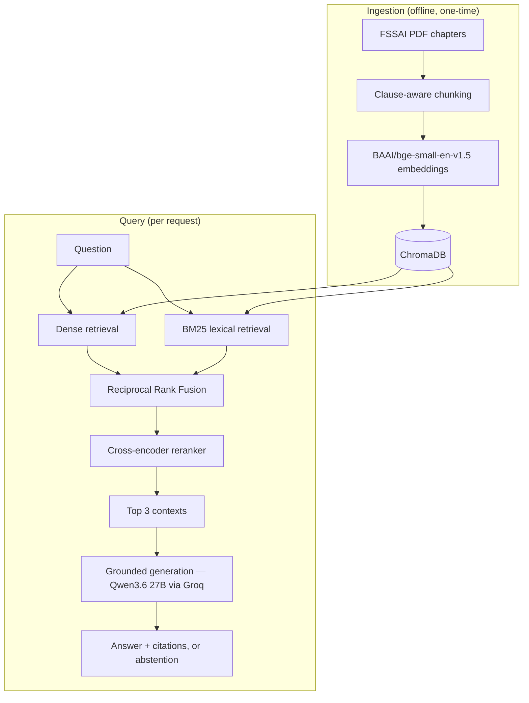

# FSSAI Food Safety RAG QA System

An end-to-end RAG QA system over FSSAI food safety regulations: clause-aware
chunking, three retrieval strategies evaluated systematically (dense,
hybrid, hybrid + reranking), citation-grounded generation, an API layer,
and a containerized deployment.

This is a portfolio / take-home-style project: containerized, API-served,
logged, and evaluated end to end. It is not presented as novel retrieval
research, and it is not claimed to be production-grade — see
[Limitations](#limitations) and [What "production-shaped" means here](#what-production-shaped-means-here).

## Results

### Retrieval comparison (recall@k)

Fraction of the 15 frozen evaluation questions where the ground-truth
regulation clause appears among the top-k retrieved chunks, per arm.

| Arm | recall@1 | recall@3 | recall@5 | recall@10 | recall@20 |
|---|---|---|---|---|---|
| Dense | 0.900 | 1.000 | 1.000 | 1.000 | 1.000 |
| Hybrid (Dense + BM25 + RRF) | 0.900 | 1.000 | 1.000 | 1.000 | 1.000 |
| Hybrid + reranker | 0.767 | 1.000 | 1.000 | 1.000 | 1.000 |

**recall@3 — the system's actual operating point (`k_final=3`) — is 1.000
for all three arms, on every one of the 15 questions.** Dense retrieval
already retrieved the required clause within the top 3 for every question in
this benchmark. Hybrid retrieval and reranking had limited room to improve
recall on top of that; the reranker's only measurable cost was at rank 1,
where it destabilizes ordering relative to dense/hybrid.

### RAGAS evaluation (LLM-judged, `gpt-5-mini`)

Mean score per metric per arm, over the 15 evaluation questions (180
metric evaluations total: 15 questions × 3 arms × 4 metrics).

| Arm | Faithfulness | Answer Relevancy | Context Precision | Context Recall |
|---|---|---|---|---|
| Dense | 0.978 | 0.935 | 0.811 | 1.000 |
| Hybrid | 0.933 | 0.934 | 0.822 | 1.000 |
| Hybrid + reranker | 0.911 | 0.862 | 0.767 | 0.933 |

Full arm-comparison and per-question data: `reports/ragas_summary.csv`,
`reports/arm_comparison.csv`, `reports/failure_analysis.md`.

### Refusal / grounding check

**15/15 correct abstentions** across all three arms (5/5 each), on 5
questions from FSSAI domains never ingested into this corpus (honey,
edible oils, canned fish, fruit jam, carbonated water). The same generator,
asked these identical questions with no retrieval pipeline in front of it,
answers all 5 confidently with specific — wrong — numbers (recorded in
`decisions.md`). This is reported as **verified abstention behaviour on
out-of-scope questions**, not a general hallucination benchmark: 5
questions is a small, purpose-built set, not exhaustive failure-mode
coverage.

### Headline finding

**Dense retrieval already retrieved the required clause within the top 3
for every question in this benchmark.** Hybrid retrieval and reranking
therefore had limited room to improve recall on top of an already-saturated
baseline — this is a benchmark-scale/corpus observation (124 chunks, 3
chapters), not a claim that hybrid retrieval or reranking are ineffective in
general.

Reranking's one measurable regression (question q07, arm
`hybrid_rerank`) was **not a missed clause** — recall@k confirms the
correct clause (2.4.11) was retrieved — **it was chunk fragmentation**: that
clause is split across several chunked parts (its additive-limit table is a
separate chunk from its labelling text), and the cross-encoder promoted the
wrong part into the top 3. The system correctly abstained rather than
answer from the wrong part. See `reports/failure_analysis.md` for the full
walkthrough.

## Architecture



Full diagram and per-component notes: [`docs/architecture.md`](docs/architecture.md).

**Components:**
- **Clause-aware chunking** (`src/chunking.py`) — splits each regulation
  chapter along clause boundaries rather than fixed token windows, so a
  retrieved chunk corresponds to a coherent regulatory unit. Long clauses
  (multi-page tables) are split into multiple parts — this is the mechanism
  behind the reranker's q07 regression (see above).
- **Dense retrieval** (`src/retrieval/vector.py`) — local `bge-small`
  embeddings over a persisted ChromaDB collection.
- **BM25** (`src/retrieval/bm25.py`) — lexical retrieval over the same
  chunks, for exact tokens (clause numbers, INS additive codes, chemical
  names) dense embeddings under-weight.
- **RRF** (`src/retrieval/hybrid.py`) — rank-based fusion of dense + BM25,
  since their raw scores (cosine distance vs. an unbounded lexical score)
  aren't directly comparable.
- **Reranking** (`src/retrieval/rerank.py`) — a local cross-encoder
  (`cross-encoder/ms-marco-MiniLM-L-6-v2`) re-scores the fused candidate
  pool before the final top-3 cut.
- **Grounded generation** (`src/generate.py`) — answers only from the
  supplied context, citing clause numbers, abstaining when context is
  insufficient. Generator: `qwen/qwen3.6-27b` via Groq.

## API

```
GET  /health          -- service status, Chroma chunk count, model info
POST /query            -- ask a question against one retrieval arm
```

`POST /query` requires an `X-API-Key` header and a JSON body:

```json
{"question": "What is the minimum milk fat percentage for Table Butter?", "arm": "hybrid_rerank"}
```

`arm` is one of `dense`, `hybrid`, `hybrid_rerank`. Response:

```json
{
  "request_id": "...",
  "answer": "The minimum milk fat percentage required for Table Butter is 80.0%.",
  "citations": ["2.1.9"],
  "abstained": false,
  "retrieved_clauses": ["2.1.9", "2.1.8", "2.1.7"],
  "latency": {"retrieval_ms": 21.8, "generation_ms": 2136.4, "total_ms": 2158.2}
}
```

Every request is logged to `logs/requests.jsonl` (request ID, arm, question,
retrieved clauses, abstention flag, per-stage latency, token usage, status)
— never the API key, the auth header, or full retrieved chunk text — so a
failed answer can be traced to a retrieval stage or a generation stage.

## Running locally

```bash
python -m venv venv && source venv/bin/activate
pip install -r requirements.txt
cp .env.example .env   # fill in GROQ_API_KEY and APP_API_KEY
uvicorn app.api:app --reload
```

## Running with Docker

```bash
git clone <this repo>
cd rag-foodsafety
docker build -t fssai-rag-api .
docker run -d -p 8000:8000 \
  -e GROQ_API_KEY=<your key> \
  -e APP_API_KEY=<your chosen key> \
  fssai-rag-api

curl http://localhost:8000/health
curl -X POST http://localhost:8000/query \
  -H "Content-Type: application/json" -H "X-API-Key: <your chosen key>" \
  -d '{"question":"What is the maximum permitted urea content in milk?","arm":"dense"}'
```

**Deployment notes:**
- The pre-built ChromaDB vector store (`data/chroma/`, ~5MB) is committed
  to git and baked into the image, so a clean clone + `docker build` works
  without re-running ingestion. Tradeoff: the DB can drift out of sync with
  the corpus/chunking code if either changes without re-ingesting and
  re-committing — acceptable for a demo deployment, not for an
  auto-updating one.
- `torch` is installed from PyTorch's CPU wheel index — no CUDA dependency,
  since this serves on CPU.
- `requirements-api.txt` (not the full `requirements.txt`) is what the
  image installs — it excludes the Stage 2 evaluation dependencies
  (RAGAS, OpenAI SDK, LangChain), which the served API never imports.
- `.env` is never copied into the image; secrets are passed at `docker run`
  time via `-e`.

## Evaluation methodology

15 frozen evaluation questions + 5 frozen refusal questions, both committed
to git *before* any retrieval, reranking, generation, or scoring ran against
them (`data/qa_set.json`, `data/refusal_set.json` — see `decisions.md` for
the exact freeze commit). Three retrieval arms compared under an identical
`k_final=3`: dense only, hybrid (dense + BM25 + RRF), and hybrid + reranking.
Generation is deterministic (`temperature=0`). Judging is a separate,
frozen Stage 2 pass (`eval/run_ragas.py`) over the frozen Stage 1
generations — RAGAS, judged by `gpt-5-mini`, four metrics: Faithfulness,
Answer Relevancy, Context Precision, Context Recall.

Full evaluation history, including two RAGAS/GPT-5-mini compatibility bugs
found and fixed during the pilot, cost estimates vs. actual spend, and every
methodological decision along the way, is in `decisions.md`.

## Limitations

- **Small benchmark**: 15 evaluation questions + 5 refusal questions.
  Differences below ~0.03 between arms are noise at this sample size, not
  a reliable signal.
- **Narrow corpus**: 3 chapters of one regulation (Dairy, Cereals,
  Salt/Spices/Condiments), 124 chunks. The saturation finding (dense
  retrieval already achieving recall@3 = 1.0) is a property of this small
  corpus, not a general claim about dense retrieval.
- **No load testing** — latency numbers reflect single-request, local/demo
  conditions, not concurrent traffic.
- **No CI** — validation in this project was run manually, not on every
  commit.
- **RAGAS is LLM-judged**: Faithfulness/Answer Relevancy/Context
  Precision/Context Recall are themselves generated by an LLM (`gpt-5-mini`)
  scoring another LLM's output — an established but imperfect evaluation
  methodology, not a ground-truth measurement.

## What "production-shaped" means here

This project is containerized, API-served, logged, and evaluated. It does
not have monitoring/alerting, CI/CD, autoscaling, load testing, or an SLA —
the things that would make "production-grade" an accurate claim. See
`docs/INTERVIEW_NOTES.md` for how this distinction gets explained out loud.
