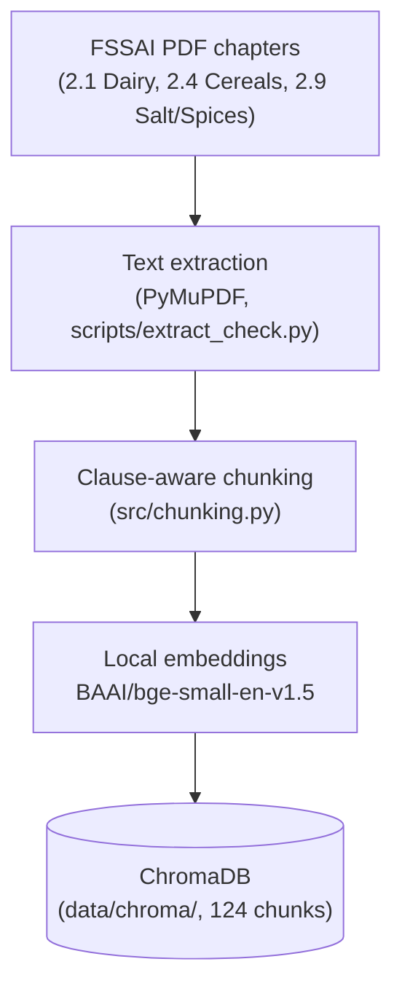
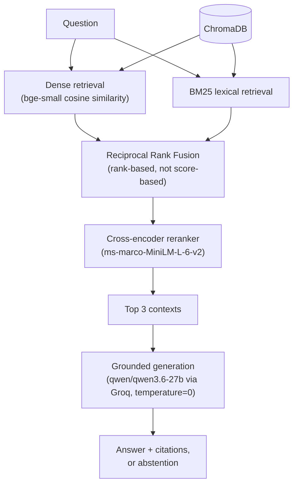

# Architecture

Two separate flows: an offline **ingestion** pipeline that runs once (or
whenever the corpus changes), and a per-request **query** pipeline that the
FastAPI app runs on every call to `POST /query`.

## Ingestion (offline, one-time)

Chunking follows clause boundaries in the source regulation text rather
than a fixed token window, so each stored chunk corresponds to one
coherent regulatory unit (a clause's description, composition table, or
labelling section) with clause/chapter/page/heading metadata attached. A
long clause with a multi-page table is split into several parts sharing
the same clause number — this detail matters later (see the reranker
regression below).

## Query (per request)

Three retrieval **arms** are evaluated against this same pipeline shape,
differing only in how far along it a given request goes:

| Arm | Path |
|---|---|
| Dense | `Q -> D -> top 3` |
| Hybrid | `Q -> D + B -> RRF -> top 3` |
| Hybrid + reranker | `Q -> D + B -> RRF -> top 20 candidate pool -> R -> top 3` |

`k_final=3` (the final context size) and `candidate_k=20` (the pool size
RRF and the reranker draw from) are identical across all three arms —
only the retrieval/ranking method differs, never the final context size,
so the comparison isolates the retrieval method's effect.

## Why each component is there

- **Dense retrieval** handles semantic similarity — paraphrased questions
  that don't share vocabulary with the source clause.
- **BM25** handles exact tokens dense embeddings tend to under-weight:
  clause numbers, INS additive codes, chemical names (e.g. "allyl
  isothiocyanate").
- **RRF** fuses the two without comparing their raw scores directly —
  BM25's unbounded lexical score and Chroma's cosine distance are not on
  the same scale, so fusion happens by rank, not score.
- **Reranking** re-scores a cheap first-stage candidate pool (20) with a
  more expensive cross-encoder that jointly attends over the query and
  each candidate's full text, rather than comparing independently-computed
  embedding vectors.
- **Grounded generation** answers only from the supplied top-3 context,
  cites the clause number(s) it drew from, and explicitly abstains when
  the context doesn't support an answer.

## Why reranking didn't clearly improve results here

The evaluation's own recall@k diagnostic (`recall@3 = 1.000` for all three
arms, on every one of the 15 questions) shows dense retrieval already
placed the correct clause in the top 3 every time on this benchmark —
there was no missing-document problem left for hybrid retrieval or
reranking to fix.

The one case where the reranker did measurably worse (question q07, arm
`hybrid_rerank`) is not a counterexample to that: RAGAS's Context Precision
metric and the recall@k diagnostic agree the correct **clause** (2.4.11)
was retrieved — the reranker just selected the wrong **part** of it (a
labelling section, not the additive-limit table two chunks over). This is
the clause-fragmentation limitation from the ingestion diagram above
surfacing at generation time: the system correctly abstained rather than
answer from the wrong part, but the retrieval regression is real and
attributable to a specific, explainable cause — not "the reranker is bad,"
and not "reranking failed" in general.

See `reports/failure_analysis.md` for the full per-question breakdown and
`README.md` ("Results") for the headline numbers this is based on.
